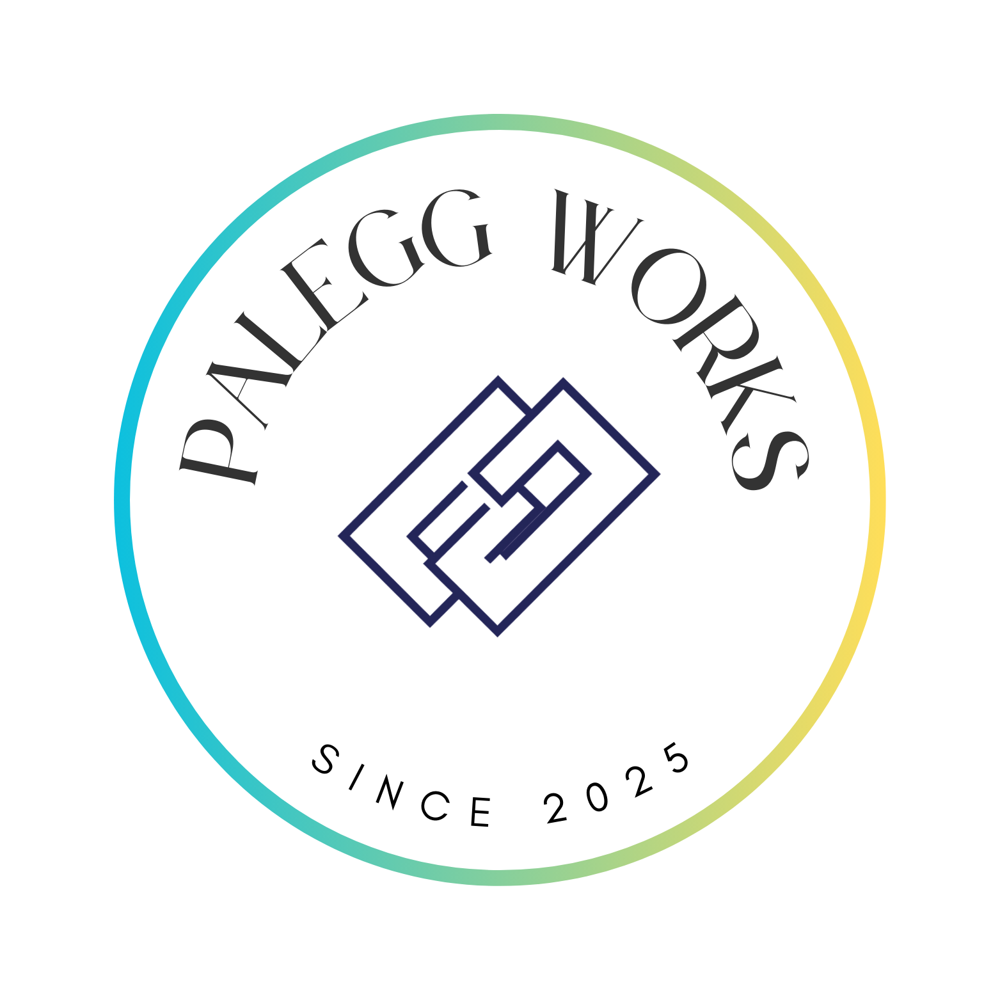

# [Palegg Works](https://palegg-works.github.io/)

_Food for Simple Thoughts; Apps for Mindful Lives_

## Our Motivation

_Palegg Works_ was born from a passion for creating digital tools with mindfulness. I believe that thoughtfully designed apps can empower mindful productivity and foster healthy habits, helping individuals focus on what truly matters and lead more intentional lives. Inspired by the Norwegian concept of "Palegg" – diverse toppings that nourish – we aim to build a variety of digital "food for simple thoughts" that serve your journey towards a more focused and balanced existence.

## What We Do

We specialize in developing custom applications focused on mindful productivity and consistency. Currently, we achieve this by coding in Rust and Python.

